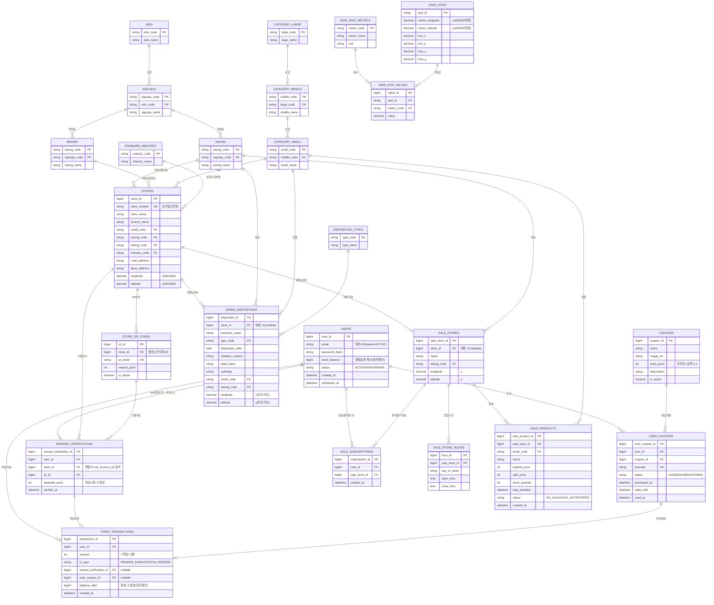

# DATABASE.md

Ding-Dong11-BE 데이터베이스 구조 문서. **코드를 작성할 때마다 이 문서를 참고하여 개발한다** (CLAUDE.md 참조).

## 개요

- **RDBMS**: PostgreSQL (지도 좌표 공간 질의를 위해 **PostGIS 확장** 사용 권장)
- **In-memory**: Redis (refresh token, 이메일 인증코드 등 휘발성 데이터)
- **정규화**: 1NF → 2NF → 3NF → BCNF 순차 적용. 무결성 강제용 의도적 비정규화 1건(REWARD_VERIFICATIONS.store_id)만 예외.
- **공공데이터**: 소상공인시장진흥공단 전국 상가업소 정보 + 국토지리정보원 격자 통계 + 식약처 행정처분(식품접객업) → x/y 좌표 가공 적재.
- **테이블 수**: 24개 (아래 ERD 참조).

## Redis 관리 항목 (DB 테이블 아님)

| 용도 | 키 패턴 | 값 | TTL |
|---|---|---|---|
| Refresh Token | `refresh_token:{user_id}` | 토큰 문자열(또는 jti) | 리프레시 만료(예: 14일) |
| 이메일 인증코드 | `email_verify:{email}` | 6자리 코드(대문자+숫자) | 600초 (10분) |
| 인증코드 재발급 쿨다운 | `email_verify:cooldown:{email}` | 발급 마커 | 180초 (3분) |

- **챗봇(FUNC-005)**: 대화 세션/메시지는 DB에 영구 저장하지 않는다. 필요 시 Redis 임시 버퍼로만 처리.
- Refresh Token은 회전(rotation)/블랙리스트 전략 시 `refresh_token:{user_id}` 대신 `refresh:jti:{jti}` 형태로 확장 가능.

---

## ERD



---

## 테이블 상세 (기능 · 인덱스 · 제약)

### 1. USERS — 회원 (FUNC-001, 008-01)
- **기능**: 회원 계정. 로그인(email+password_hash), 로그아웃/탈퇴(status·withdrawn_at 소프트삭제), 보유 포인트 조회(point_balance).
- **인덱스**: PK(user_id) / 부분 유니크 `UNIQUE(email) WHERE status='ACTIVE'`(탈퇴 후 동일 이메일 재가입 허용).
- **제약**: `status IN ('ACTIVE','WITHDRAWN')`. `point_balance`는 POINT_TRANSACTIONS 집계 캐시 — 적립/사용과 동일 트랜잭션에서 원자 갱신.

### 2. SIDO / 3. SIGUNGU / 4. ADONG / 5. BDONG — 행정구역 (지역 룩업)
- **기능**: 주소 코드→명칭 이행종속 제거(3NF/BCNF). 상가·행정처분·세일 마트의 지역 참조. ADONG(행정동)/BDONG(법정동)을 분리해 공공데이터 병기 손실 방지.
- **인덱스**: 각 코드 PK. SIGUNGU(sido_code), ADONG/BDONG(sigungu_code) FK 인덱스.

### 6. CATEGORY_LARGE / 7. CATEGORY_MIDDLE / 8. CATEGORY_SMALL — 업종 분류 (FUNC-002-04, 004)
- **기능**: 상권업종 대/중/소 3계층. 업종 필터·정렬의 기준. 상가/행정처분/세일상품이 소분류(leaf) 참조.
- **인덱스**: 각 코드 PK. MIDDLE(large_code), SMALL(middle_code) FK 인덱스.

### 9. STANDARD_INDUSTRY — 표준산업분류 룩업
- **기능**: 상가의 표준산업분류코드→명칭. 업종(상권분류)과는 다른 축의 분류.
- **인덱스**: industry_code PK.

### 10. STORES — 상가/업소 (소상공인시장진흥공단) (FUNC-003-01, 006)
- **기능**: 지도 pin 표시, 상가 상세, 리워드 QR 대상, 추천 산출 기준(업종/지역).
- **인덱스**: PK(store_id) / `UNIQUE(store_number)` / FK(small_code, adong_code, bdong_code, industry_code) / **공간 인덱스**(아래 최적화 참조).
- **제약**: longitude/latitude는 지도 대상 → 적재 시 NOT NULL 권장(결측 데이터는 적재 제외 또는 지오코딩 보정).

### 11. ADMIN_DISPOSITIONS — 행정처분 (식약처) (FUNC-002)
- **기능**: 처분 이력 매장 지도 마커, 마커 클릭 상세(업체명/처분내용/처분일자/근거법령/처분기관), 업종·처분종류 필터.
- **인덱스**: PK / FK(store_id nullable, type_code, small_code, adong_code) / 공간 인덱스 / (disposition_date) 정렬 · (type_code) 필터 / **자연키 유니크 인덱스** `(business_name, disposition_date, type_code, COALESCE(authority,''))` — ETL 재적재 시 멱등 upsert 용(식약처 원천에 안정적 대리키가 없음).
- **제약**: 식약처 원천이라 store_id는 매칭 성공 시에만 채움(nullable). 좌표는 주소 지오코딩으로 보정.

### 12. DISPOSITION_TYPES — 처분 유형 룩업
- **기능**: 처분유형코드→명칭(3NF 분리). FUNC-002-04 처분종류 필터.
- **인덱스**: type_code PK.

### 13. GRID_STATS / 14. GRID_STAT_METRICS / 15. GRID_STAT_VALUES — 격자 통계 (국토지리정보원)
- **기능**: 격자 중심/경계 좌표 + 다중 통계 지표. 추천/분석 근거 데이터(화면 직접 표시 아님). GRID_STAT_VALUES로 지표를 세로 정규화(1NF 반복그룹 제거).
- **인덱스**: GRID_STATS(grid_id PK), GRID_STAT_METRICS(metric_code PK), GRID_STAT_VALUES `UNIQUE(grid_id, metric_code)` + FK 인덱스.
- **제약**: 좌표계는 UTM-K(EPSG:5179) → WGS84(EPSG:4326) 변환 후 적재.

### 16. STORE_QR_CODES — 상가 QR (FUNC-003-03)
- **기능**: 상가당 리워드 QR. 인증 시 reward_point 지급.
- **인덱스**: PK(qr_id) / `UNIQUE(qr_token)` / **부분 유니크 `UNIQUE(store_id) WHERE is_active=true`**(상가당 활성 QR 1건).
- **제약**: 복합 유일키 `(qr_id, store_id)`를 REWARD_VERIFICATIONS 복합 FK 대상용으로 노출.

### 17. REWARD_VERIFICATIONS — QR 인증 이력 (FUNC-003-03, 006)
- **기능**: 사용자가 QR을 찍은 이력 = 포인트 적립 근거 + **FUNC-006 추천 산출 소스**. 이 이력을 STORES(업종/지역)와 집계해 연관도 높은 상가를 실시간 추천.
- **인덱스**: PK / (user_id, verified_at) 이력·추천 집계 / (store_id) / 복합 FK 인덱스.
- **제약**: **복합 FK `(qr_id, store_id) → store_qr_codes(qr_id, store_id)`** 로 "QR이 해당 상가 소속"을 DB 강제. store_id는 이 무결성용 의도적 비정규화. 동일 상가 중복 남용 방지는 애플리케이션 정책.

### 18. POINT_TRANSACTIONS — 포인트 원장 (FUNC-003-03, 007, 008-01)
- **기능**: 적립(REWARD_EARN)·사용(COUPON_REDEEM) 원장. USERS.point_balance의 정합성 소스.
- **인덱스**: PK / (user_id, created_at) 잔액·이력 조회 / FK(reward_verification_id, user_coupon_id).
- **제약**: `tx_type IN ('REWARD_EARN','COUPON_REDEEM')`, `amount <> 0`. reward_verification_id/user_coupon_id는 tx_type에 따라 배타적(둘 중 하나만 NOT NULL) — CHECK 권장.

### 19. SALE_STORES — 세일 마트/가게 (FUNC-004-02/03)
- **기능**: 세일 상점 지도 마커, 상세(이름/영업시간). 공공 상가와 매칭 시 store_id 연결(nullable).
- **인덱스**: PK / FK(store_id, adong_code) / 공간 인덱스.

### 20. SALE_STORE_HOURS — 영업시간 (FUNC-004-03)
- **기능**: 요일별 영업시간(문자열 대신 정규화, 1NF).
- **인덱스**: PK / FK(sale_store_id) / (sale_store_id, day_of_week).

### 21. SALE_PRODUCTS — 세일 상품 (FUNC-004-01/03)
- **기능**: 마감할인 상품. 목록 피드/상세, 재고·마감시각·상태. 할인율은 파생이라 미저장(원가·할인가로 계산).
- **인덱스**: PK / FK(sale_store_id, small_code) / (status) · (sale_deadline) 마감순 정렬 · (small_code) 카테고리 필터.
- **제약**: `sale_price <= original_price`, `stock_quantity >= 0`, `status IN ('ON_SALE','SOLD_OUT','EXPIRED')`.

### 22. SALE_SUBSCRIPTIONS — 관심/즐겨찾기 (FUNC-004-01)
- **기능**: 사용자의 세일 마트 즐겨찾기(알림 미연동 — 알림 기능 없음).
- **인덱스**: PK / `UNIQUE(user_id, sale_store_id)` 중복 방지 / FK(sale_store_id).

### 23. COUPONS — 쿠폰 카탈로그 (FUNC-007-02)
- **기능**: 구매 가능한 기프티콘 목록(카드형). point_price = 금액 1:1.
- **인덱스**: PK / (is_active) 노출 필터.

### 24. USER_COUPONS — 보유 쿠폰 (FUNC-007-01, 008-02)
- **기능**: 구매·발급된 기프티콘. 바코드·사용기간·상태. 마이페이지 보관함.
- **인덱스**: PK / `UNIQUE(barcode)` / (user_id, status) 보관함 조회 / FK(coupon_id).
- **제약**: `status IN ('UNUSED','USED','EXPIRED')`. 구매 시 POINT_TRANSACTIONS(-차감)과 동일 트랜잭션.

---

## ETL 보조 테이블 (공공데이터 적재 파이프라인 전용, 도메인 ERD 제외)

`app/etl/`(develop.md 참조)가 사용하는 staging/이력 테이블. 사용자 대면 기능과 무관하며 서비스/리포지토리 레이어가 참조하지 않는다.

- **ETL_RAW_RECORDS**: Extract 단계 원본 보관(`raw_id` PK, `source`, `payload jsonb`, `collected_at`, `processed`, `processed_at`). Transform 재실행 시 외부 API 재호출 없이 재처리하기 위함. 인덱스: `(source, processed)`.
- **ETL_RUN**: 파이프라인 실행 이력(`run_id` PK, `source`, `status` `RUNNING/SUCCESS/FAILED`, `started_at`, `finished_at`, `extracted_count`, `loaded_count`, `failed_count`, `cursor`, `error`). 재실행 시 마지막 성공 커서 기준 재개. 인덱스: `(source, started_at DESC)`.
- **RAW_GEOCODE_CACHE**: 식약처 행정처분 주소→좌표 지오코딩 결과 캐시(`cache_id` PK, `address_hash` UK, `address_text`, `provider`, `longitude`, `latitude`, `created_at`). 동일 주소 재호출 방지(`GEOCODE_CACHE_TTL_SECONDS` 경과 시 재조회).

---

## 인덱스 & 최적화 요약 (PostgreSQL)

```sql
-- 회원: 활성 계정만 이메일 유니크(탈퇴 후 재가입 허용)
CREATE UNIQUE INDEX uq_users_email_active ON users(email) WHERE status = 'ACTIVE';

-- 지도 공간 인덱스: PostGIS geometry + GiST (지도 조회·거리 계산 최적화)
--   longitude/latitude 컬럼과 함께 geom 생성 컬럼을 두고 GiST 인덱스 권장
ALTER TABLE stores             ADD COLUMN geom geometry(Point, 4326)
  GENERATED ALWAYS AS (ST_SetSRID(ST_MakePoint(longitude, latitude), 4326)) STORED;
ALTER TABLE admin_dispositions ADD COLUMN geom geometry(Point, 4326)
  GENERATED ALWAYS AS (ST_SetSRID(ST_MakePoint(longitude, latitude), 4326)) STORED;
ALTER TABLE sale_stores        ADD COLUMN geom geometry(Point, 4326)
  GENERATED ALWAYS AS (ST_SetSRID(ST_MakePoint(longitude, latitude), 4326)) STORED;
CREATE INDEX idx_stores_geom            ON stores USING GIST (geom);
CREATE INDEX idx_dispositions_geom      ON admin_dispositions USING GIST (geom);
CREATE INDEX idx_sale_stores_geom       ON sale_stores USING GIST (geom);

-- 상가 QR: 상가당 활성 QR 1건 + 복합 유일키(복합 FK 대상)
CREATE UNIQUE INDEX uq_store_qr_active  ON store_qr_codes(store_id) WHERE is_active = true;
CREATE UNIQUE INDEX uq_store_qr_pair    ON store_qr_codes(qr_id, store_id);

-- 리워드 이력/추천 집계
CREATE INDEX idx_reward_user_time       ON reward_verifications(user_id, verified_at DESC);

-- 포인트 원장
CREATE INDEX idx_point_tx_user_time     ON point_transactions(user_id, created_at DESC);

-- 세일 목록 필터/정렬
CREATE INDEX idx_sale_products_deadline ON sale_products(status, sale_deadline);
CREATE INDEX idx_sale_products_category ON sale_products(small_code);

-- 보유 쿠폰
CREATE INDEX idx_user_coupons_user      ON user_coupons(user_id, status);

-- 행정처분 자연키(ETL 멱등 upsert): 식약처 원천에 안정적 대리키가 없어 조합키로 대체
CREATE UNIQUE INDEX uq_admin_dispositions_natural
  ON admin_dispositions(business_name, disposition_date, type_code, COALESCE(authority, ''));

-- 관심 중복 방지
CREATE UNIQUE INDEX uq_sale_subs        ON sale_subscriptions(user_id, sale_store_id);
```

**스키마 설정 원칙**
- 좌표는 `numeric`/`double precision` + PostGIS `geometry(Point, 4326)` 병행. 지도·거리(FUNC-004 거리순) 질의는 GiST 공간 인덱스로 처리.
- 모든 FK 컬럼에 인덱스 부여(조인·필터 성능).
- 대용량 이력 테이블(`point_transactions`, `reward_verifications`)은 데이터 증가 시 `created_at`/`verified_at` 기준 범위 파티셔닝 검토.
- ENUM 성격 컬럼(status, tx_type 등)은 CHECK 제약 또는 PostgreSQL `ENUM` 타입으로 강제.
- 파생 저장값(`point_balance`, `balance_after`)은 반드시 원장 변경과 **동일 트랜잭션**에서 갱신.

---

## 공공데이터 적재(ETL)

1. **소상공인 상가업소**: 경도/위도(WGS84) 대체로 제공 → `stores.longitude/latitude` 직입력.
2. **국토지리정보원 격자 통계**: UTM-K(EPSG:5179) → WGS84(EPSG:4326) 변환 후 격자 중심/경계 좌표 적재.
3. **식약처 행정처분**: 좌표 미제공 가능 → 주소 지오코딩(주소→x/y) 후 적재.
4. Staging(raw) 적재 → 지역/업종 코드 매핑·중복 제거 → 정규화 테이블 이관 순으로 진행.
